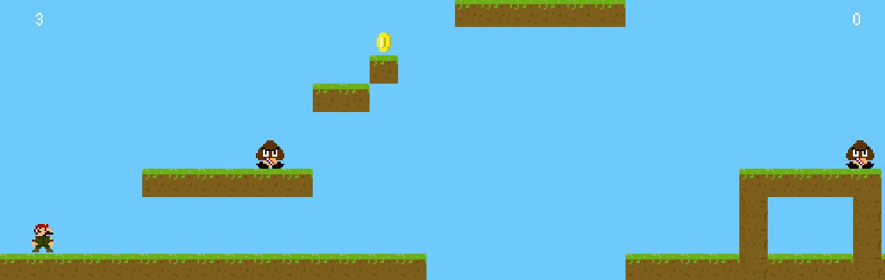

# Mario Bros Remake Project



This project is a personal study in game development, aimed at recreating a 2D platformer game using Java's JFrame and Canvas. The main goal is to learn and practice game development techniques and concepts.

## Features

- Recreation of the classic 2D platformer game "Mario Bros" with simplified mechanics.
- Player controls: `A` to move left, `D` to move right, and `SPACE` to jump.
- Includes one enemy character and types of tiles for level design.
- Utilizes a tile map system for creating complex level layouts.

## How to Run

### Requirements
- Java Runtime Environment (JRE) version 1.8.0 or higher.

   **Compile and Run**
   - Open a terminal or command prompt.
   - Navigate to the project's root directory.
   - Use the following commands to compile and run the project:

   ```bash
   javac Main.java
   java Main

    This will compile and execute the Java program.

## Controls

- **A:** Move left
- **D:** Move right
- **SPACE:** Jump

## Project Structure

- `src/`: Contains the source code for the project.
- `resources/`: Contains any additional resources, such as images or tile maps.


## Notes

- This project is intended for personal study and learning purposes only.
- The game mechanics and assets are simplified versions inspired by the original "Mario Bros" game.

## Future Improvements

- Some bugs needs to be fixed
- Create different maps


